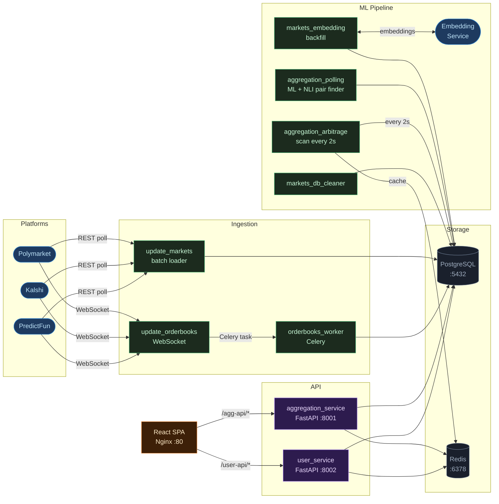

# Prediction Markets Arbitrage Engine

Detects arbitrage opportunities across [Polymarket](https://polymarket.com), [Kalshi](https://kalshi.com), and [PredictFun](https://predict.fun) in real time.

Markets are matched semantically (sentence-transformers + NLI cross-encoder), live orderbooks are tracked via WebSocket, and the arbitrage worker scans matched pairs every 2 seconds looking for YES/NO price inefficiencies.

---

## Table of Contents

1. [Architecture](#1-architecture)
2. [How It Works](#2-how-it-works)
3. [Services](#3-services)
4. [Quick Start](#4-quick-start-docker-compose)
5. [Environment Variables](#5-environment-variables)
6. [API](#6-api)

---

## 1. Architecture



**Data stores:**

| Store | Used by |
|---|---|
| `postgres` | aggregation_service, update_markets_service, update_orderbooks_service |
| `user_postgres` | user_service only (independent) |
| `redis` | arbitrage cache, rate limiting, Celery broker |

---

## 2. How It Works

### Market pair matching

1. `update_markets_service` fetches markets from all three platforms on a schedule, upserts them into PostgreSQL.
2. `markets_embedding` generates two embeddings per market — title embedding and semantic embedding (built from title + resolve criteria) — via an external embedding service.
3. `aggregation_polling` runs a nearest-neighbour search over embeddings to find candidate pairs (max distance 0.5), then re-ranks them with a cross-encoder (NLI model) to get a final similarity score. Pairs above threshold (0.7) are saved.

### Arbitrage detection

`aggregation_arbitrage` loops every 2 seconds:
- Loads matched pairs with live orderbooks from PostgreSQL.
- For each pair checks both directions: buy YES on platform A + buy NO on platform B, and vice versa.
- A trade is profitable when the combined entry cost < 1.0 (e.g., 0.45 + 0.48 = 0.93 → 7% spread).
- Results (direction, entry prices, PnL at each depth level) are cached in Redis for the API to serve instantly.

### Live orderbooks

`update_orderbooks_service` maintains three concurrent WebSocket connections (one per platform) with auto-restart on crash. Incoming updates are dispatched to a Celery worker that persists them to PostgreSQL.

---

## 3. Services

| Container | Port | Role |
|---|---|---|
| `aggregation_service` | 8001 | FastAPI — markets, pairs, arbitrage endpoints |
| `aggregation_polling` | — | Background: finds new similar market pairs via ML |
| `aggregation_arbitrage` | — | Background: scans pairs every 2s, writes to Redis cache |
| `update_markets_service` | — | Background: polls Polymarket / Kalshi / PredictFun, upserts markets |
| `markets_embedding` | — | Background: generates embeddings for markets missing them |
| `markets_db_cleaner` | — | Background: removes closed/resolved markets |
| `update_orderbooks_service` | — | WebSocket manager: streams live orderbooks from all platforms |
| `orderbooks_worker` | — | Celery: persists orderbook batches to PostgreSQL |
| `user_service` | 8002 | FastAPI — auth, subscriptions, crypto payments |
| `frontend2` | 80/443 | React SPA served via Nginx with TLS |

---

## 4. Quick Start (Docker Compose)

### Prerequisites

- Docker Desktop
- An external Docker network named `embedding_default` (used by the embedding service):

```bash
docker network create embedding_default
```

### Run

1. Copy and fill the env files (see [Environment Variables](#5-environment-variables)):

```bash
cp aggregation_service/.env.example aggregation_service/.env
cp update_markets_service/.env.example update_markets_service/.env
cp update_orderbooks_service/.env.example update_orderbooks_service/.env
cp user_service/.env.example user_service/.env
```

2. Start the stack:

```bash
docker compose up -d --build
docker compose logs -f aggregation_service
```

3. Entry points:
   - Frontend: `http://localhost`
   - Aggregation API + Swagger: `http://localhost:8001/docs`
   - User API + Swagger: `http://localhost:8002/docs`

Stop with `docker compose down` (`-v` also removes volumes).

---

## 5. Environment Variables

Each service has its own `.env`. Nested keys use `__` as delimiter.

### aggregation_service/.env

```env
DB__USER=postgres
DB__PASSWORD=your_password
DB__HOST=postgres
DB__PORT=5432
DB__NAME=aggregation

REDIS__HOST=redis
REDIS__PORT=6378
REDIS__PASSWORD=
REDIS__DB=0

JWT__SECRET_KEY=your_secret_key

ARBITRAGE__PRICE_THRESHOLD=0.97   # max combined YES+NO price to enter trade
ARBITRAGE__MIN_SIZE=25            # min contract size in orderbook
ARBITRAGE__SCAN_INTERVAL=2        # seconds between scans

SENTRY__DSN=
LOG_LEVEL=INFO
```

### user_service/.env

```env
DB__USER=postgres
DB__PASSWORD=your_password
DB__HOST=user_postgres
DB__PORT=5432
DB__NAME=user_service

JWT__SECRET_KEY=your_secret_key

NOWPAYMENTS__API_KEY=your_nowpayments_key
NOWPAYMENTS__IPN_SECRET=your_ipn_secret
NOWPAYMENTS__WEBHOOK_BASE_URL=https://yourdomain.com

EMAIL__HOST=smtp.gmail.com
EMAIL__PORT=587
EMAIL__USERNAME=your@gmail.com
EMAIL__PASSWORD=your_app_password
EMAIL__FROM_EMAIL=your@gmail.com

REDIS__URL=redis://redis:6378

SENTRY__DSN=
APP__DOMAIN=https://yourdomain.com
```

---

## 6. API

### Aggregation service — `http://localhost:8001`

| Method | Endpoint | Description |
|---|---|---|
| `GET` | `/markets/pairs` | Matched market pairs (filterable by score, distance) |
| `GET` | `/markets/search` | Full-text search by title |
| `GET` | `/markets/orderbooks` | Live orderbooks for a set of market IDs |
| `GET` | `/arbitrage/scan_cache` | Latest arbitrage results from Redis cache |
| `GET` | `/arbitrage/scan` | Fresh arbitrage scan (bypasses cache) |
| `GET` | `/arbitrage/compute` | Arbitrage for two specific markets |
| `GET` | `/arbitrage/stats` | Public stats: opportunity count, best spread, platforms |
| `GET` | `/healthcheck` | Health check |

### User service — `http://localhost:8002`

| Method | Endpoint | Description |
|---|---|---|
| `POST` | `/auth/register` | Register + send email verification |
| `POST` | `/auth/login` | Login → access + refresh tokens (rate-limited) |
| `POST` | `/auth/refresh` | Rotate tokens |
| `GET` | `/users/me` | Current user profile |
| `GET` | `/subscriptions/plans` | Available subscription plans |
| `POST` | `/subscriptions/buy` | Purchase subscription (crypto) |
| `GET` | `/transactions` | Transaction history |
| `POST` | `/payments/webhook` | NOWPayments IPN webhook |